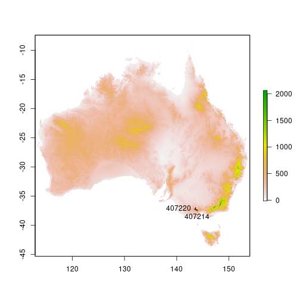
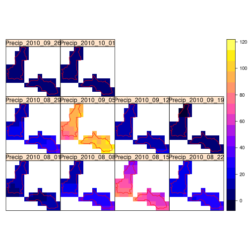
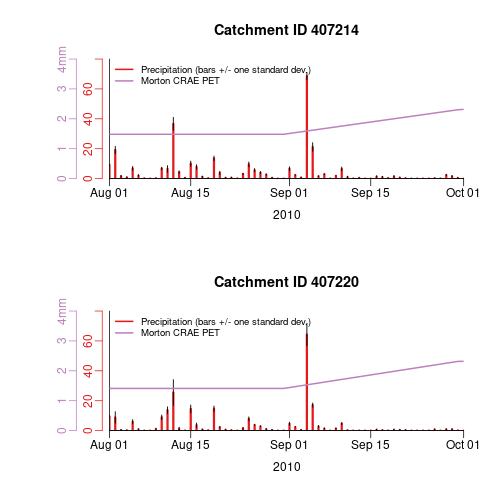

```r
library(AWAPer, warn.conflicts = FALSE)
```

## Load extra packages for the vignette
The mapping of the results below requires the following packages.


```r
library(raster)
#> Loading required package: sp
library(sp)
```

## Make netCDF files
The first step is to create the netCDF files. Here two netCDF files are created (one for precip. temperature, vapour pressure deficit and a second for solar radiation, which has a different grid geometry) and only between the dates _update.from_ and _update.to_. Importantly, these two files (and those downloaded) are created in the working directory.

If the latter two dates were not input then data would be downloaded from 1/1/1900 to yesterday. The netCDF files contain grids of the daily data for all of Australia and is used below to extract data within the catchment boundaries of interest.

Often users run _makeNetCDF_file_ once to build netCDF data files that contain all variables over the entire record length (which requires ~5GB disk storage) and then use the netCDFs grids for multiple projects, rather than re-building the netCDF for each project. Also, if _makeNetCDF_file_ is run with the the netCDF file names pointing to existing files and _updateFrom=NA_ then the netCDF files will be updated to yesterday.


```r
netCDF_filename = 'AWAP_demo.nc'
netCDF_solar_filename = 'AWAP_solar_demo.nc'
date.from = as.Date("2010-08-01","%Y-%m-%d")
date.to = as.Date("2010-10-01","%Y-%m-%d")

fnames = makeNetCDF_file(ncdfFilename = netCDF_filename,
                         ncdfSolarFilename = netCDF_solar_filename,
                         updateFrom = date.from,
                         updateTo = date.to)
#> Starting to update both netCDF files.
#> ... Testing downloading of AWAP precip. grid
#> ... Getting grid gemoetry from file.
#> ... Deleting /home/timjp/Documents/SRC/AWAPer/vignettes/precip.20000101.grid.gz
#> ... Testing downloading of AWAP tmin grid
#> ... Testing downloading of AWAP tmax grid
#> ... Testing downloading of AWAP vapour pressure grid
#> ... Testing downloading of AWAP solar grid
#> ... Getting grid gemoetry from file.
#> ... Deleting /home/timjp/Documents/SRC/AWAPer/vignettes/solarrad.20000101.grid.gz
#> ... NetCDF data will be  extracted from  2010-08-01  to  2010-10-01
#> ... Starting to add data AWAP netcdf file.
#> Working on grid time point: 2010-08-01
#> Working on grid time point: 2010-08-02
#> Working on grid time point: 2010-08-03
#> Working on grid time point: 2010-08-04
#> Working on grid time point: 2010-08-05
#> Working on grid time point: 2010-08-06
#> Working on grid time point: 2010-08-07
#> Working on grid time point: 2010-08-08
#> Working on grid time point: 2010-08-09
#> Working on grid time point: 2010-08-10
#> Working on grid time point: 2010-08-11
#> Working on grid time point: 2010-08-12
#> Working on grid time point: 2010-08-13
#> Working on grid time point: 2010-08-14
#> Working on grid time point: 2010-08-15
#> Working on grid time point: 2010-08-16
#> Working on grid time point: 2010-08-17
#> Working on grid time point: 2010-08-18
#> Working on grid time point: 2010-08-19
#> Working on grid time point: 2010-08-20
#> Working on grid time point: 2010-08-21
#> Working on grid time point: 2010-08-22
#> Working on grid time point: 2010-08-23
#> Working on grid time point: 2010-08-24
#> Working on grid time point: 2010-08-25
#> Working on grid time point: 2010-08-26
#> Working on grid time point: 2010-08-27
#> Working on grid time point: 2010-08-28
#> Working on grid time point: 2010-08-29
#> Working on grid time point: 2010-08-30
#> Working on grid time point: 2010-08-31
#> Working on grid time point: 2010-09-01
#> Working on grid time point: 2010-09-02
#> Working on grid time point: 2010-09-03
#> Working on grid time point: 2010-09-04
#> Working on grid time point: 2010-09-05
#> Working on grid time point: 2010-09-06
#> Working on grid time point: 2010-09-07
#> Working on grid time point: 2010-09-08
#> Working on grid time point: 2010-09-09
#> Working on grid time point: 2010-09-10
#> Working on grid time point: 2010-09-11
#> Working on grid time point: 2010-09-12
#> Working on grid time point: 2010-09-13
#> Working on grid time point: 2010-09-14
#> Working on grid time point: 2010-09-15
#> Working on grid time point: 2010-09-16
#> Working on grid time point: 2010-09-17
#> Working on grid time point: 2010-09-18
#> Working on grid time point: 2010-09-19
#> Working on grid time point: 2010-09-20
#> Working on grid time point: 2010-09-21
#> Working on grid time point: 2010-09-22
#> Working on grid time point: 2010-09-23
#> Working on grid time point: 2010-09-24
#> Working on grid time point: 2010-09-25
#> Working on grid time point: 2010-09-26
#> Working on grid time point: 2010-09-27
#> Working on grid time point: 2010-09-28
#> Working on grid time point: 2010-09-29
#> Working on grid time point: 2010-09-30
#> Working on grid time point: 2010-10-01
#> ... NetCDF Solar data will be  extracted from  2010-08-01  to  2010-10-01
#> ... Starting to add data AWAP Solar netcdf file.
#> Working on solar grid time point: 2010-08-01
#> Working on solar grid time point: 2010-08-02
#> Working on solar grid time point: 2010-08-03
#> Working on solar grid time point: 2010-08-04
#> Working on solar grid time point: 2010-08-05
#> Working on solar grid time point: 2010-08-06
#> Working on solar grid time point: 2010-08-07
#> Working on solar grid time point: 2010-08-08
#> Working on solar grid time point: 2010-08-09
#> Working on solar grid time point: 2010-08-10
#> Working on solar grid time point: 2010-08-11
#> Working on solar grid time point: 2010-08-12
#> Working on solar grid time point: 2010-08-13
#> Working on solar grid time point: 2010-08-14
#> Working on solar grid time point: 2010-08-15
#> Working on solar grid time point: 2010-08-16
#> Working on solar grid time point: 2010-08-17
#> Working on solar grid time point: 2010-08-18
#> Working on solar grid time point: 2010-08-19
#> Working on solar grid time point: 2010-08-20
#> Working on solar grid time point: 2010-08-21
#> Working on solar grid time point: 2010-08-22
#> Working on solar grid time point: 2010-08-23
#> Working on solar grid time point: 2010-08-24
#> Working on solar grid time point: 2010-08-25
#> Working on solar grid time point: 2010-08-26
#> Working on solar grid time point: 2010-08-27
#> Working on solar grid time point: 2010-08-28
#> Working on solar grid time point: 2010-08-29
#> Working on solar grid time point: 2010-08-30
#> Working on solar grid time point: 2010-08-31
#> Working on solar grid time point: 2010-09-01
#> Working on solar grid time point: 2010-09-02
#> Working on solar grid time point: 2010-09-03
#> Working on solar grid time point: 2010-09-04
#> Working on solar grid time point: 2010-09-05
#> Working on solar grid time point: 2010-09-06
#> Working on solar grid time point: 2010-09-07
#> Working on solar grid time point: 2010-09-08
#> Working on solar grid time point: 2010-09-09
#> Working on solar grid time point: 2010-09-10
#> Working on solar grid time point: 2010-09-11
#> Working on solar grid time point: 2010-09-12
#> Working on solar grid time point: 2010-09-13
#> Working on solar grid time point: 2010-09-14
#> Working on solar grid time point: 2010-09-15
#> Working on solar grid time point: 2010-09-16
#> Working on solar grid time point: 2010-09-17
#> Working on solar grid time point: 2010-09-18
#> Working on solar grid time point: 2010-09-19
#> Working on solar grid time point: 2010-09-20
#> Working on solar grid time point: 2010-09-21
#> Working on solar grid time point: 2010-09-22
#> Working on solar grid time point: 2010-09-23
#> Working on solar grid time point: 2010-09-24
#> Working on solar grid time point: 2010-09-25
#> Working on solar grid time point: 2010-09-26
#> Working on solar grid time point: 2010-09-27
#> Working on solar grid time point: 2010-09-28
#> Working on solar grid time point: 2010-09-29
#> Working on solar grid time point: 2010-09-30
#> Working on solar grid time point: 2010-10-01
#> Data construction FINISHED..
```

## Load a catchment boundary
The meteorological data is to be extracted for two catchments. Here the catchment boundaries built into the package are loaded. However, shape files of polygons can easily be used once imported into R, which can be done using _rgdal::readOGR()_. Here the data is imported into the _catchments_ variable.

```r
data("catchments")
```

## Get the ET constants
The estimation of ET is undertaken within _AWAPer_ using the _evapotranspiration_ package. It requires a set of constants, which are built into _AWAPer_ and loaded as follows.

```r
data(constants,package='Evapotranspiration')
```

## Download and import the DEM
The estimation of potential evapotranspiration (PET) using Morton's evapotranspiration requires estimation of the elevation throughout the catchment. Here, a 9 second resolution digital evaluation model (DEM) for Australia is downloaded. Importantly, this function downloads 3.2GB of data. To avoid reloading the DEM each time it is required, below it is saved for future reuse.

```r
DEM_9s = getDEM()
#> ... Downloading DEM .zip file
#> ... Extracting DEM from the zip file
#> ... Reading in DEM file
#> Warning in showSRID(uprojargs, format = "PROJ", multiline = "NO", prefer_proj = prefer_proj): Discarded datum Unknown based on GRS80 ellipsoid in CRS definition
#> ... Converting grid to a raster data type.
save(DEM_9s, file='DEM.RDATA')
```

## Map the catchment boundaries
To check that the catchment boundaries are located as expected, they are plotted over the DEM using the _raster_ package.

```r
raster::plot(DEM_9s)
sp::plot(catchments, add =T)
with(catchments[1,], text(sp::coordinates(catchments)[1,1],sp::coordinates(catchments)[1,2],
                            labels = catchments$CatchID[1], pos = 1))
with(catchments[2,], text(sp::coordinates(catchments)[2,1],sp::coordinates(catchments)[2,2],
                            labels = catchments$CatchID[2], pos = 2))
```



## Extract and map weekly total precipitation
Here two features of _AWAPer_ are demonstrated: (i) the temporal aggregation of data, here set to weekly and (ii) the extraction of catchment spatial patterns. The first command extracts only precipitation data over the two catchments and calculates the weekly totals. The latter commands map the weekly precipitation.

Note the netCDF files must be in the working directory or the full file path must be given.

To extract only precipitation _getPrecip_ is set to _TRUE and _getTmin_, _getTmax_, _getVprp_, _getSolarrad_ and _getET_ are all set to _FALSE_.

To extract the spatial data, and not some statistic of the spatial data such as the sum, the variable _spatial.function.name_ is set to _''_.

To extract the weekly total precipitation, _temporal.timestep_ is set to _'weekly'_  and _temporal.function.name_ to _'sum'_. For the former, the options are _daily_, _weekly_, _monthly_, _quarterly_ and _annual_. For the latter, any built-in function or user-defined function that accepts a single vector of data and returns a single number should work.


```r
weeklyPrecipData = extractCatchmentData(ncdfFilename=netCDF_filename,
                                         ncdfSolarFilename=netCDF_solar_filename,
                                         extractFrom=date.from, extractTo=date.to,
                                         catchments=catchments,
                                         getTmin = F, getTmax = F, getVprp = F, getSolarrad = F, getET = F,spatial.function.name = '',
                                         temporal.timestep = 'weekly', temporal.function.name = 'sum')
#> Extraction data summary:
#>     NetCDF non-solar radiation climate data exists from  1900-01-01  to  2010-10-01
#>     Data will be extracted from  2010-08-01  to  2010-10-01  at  2  catchments
#> Starting data extraction:
#> ... Building catchment weights:
#> ... Starting to extract data across all catchments:
#> ... Calculating catchment weighted daily data.
#> Data extraction FINISHED..


v = list("sp.polygons", catchments, col = "red",first=FALSE)
sp::spplot(weeklyPrecipData,2:ncol(weeklyPrecipData), sp.layout = list(v))
```




## Extract daily precipitation and PET data
Here the daily area weighted average precipitation and PET is extracted across the two catchments. The data is extracted from the netCDF files _netCDF_filename_ and _netCDF_solar_filename_, between the dates _extract.from_ and _extract.to_. The other _AWAPer_ variables *are* extracted because they are need for the calculation of Morton's PET. Note the netCDF files must be in the working directory or the full file path must be given.

Here the estimation of PET was undertaken using Morton's wet-environment areal evapotranspiration (other options are available). The use of Morton's CREA formulation is defined by setting the _ET.function_ variable to _'ET.MortonCRAE'_. The calculation of the areal wet environment PET is defined by setting Morton's specific variable _ET.Mortons.est_ to _'wet areal ET'_ (note, other options exist within _AWAPer_ for both variables). Lastly, following https://hess.copernicus.org/articles/17/1331/2013/hess-17-1331-2013.pdf, here Morton's PET is calculated at a monthly timestep (not daily) to improve its reliability. The monthly estimate is then interpolated to daily.


```r
climateData.daily = extractCatchmentData(ncdfFilename=netCDF_filename,
                                        ncdfSolarFilename=netCDF_solar_filename,
                                        extractFrom=date.from, extractTo=date.to,
                                        catchments=catchments, temporal.timestep = 'daily', temporal.function.name='sum',spatial.function.name='var',
                                        getTmin=T, getTmax=T, getVprp=T, getSolarrad=T, getET=T,
                                        DEM=DEM_9s, ET.function='ET.MortonCRAE',
                                        ET.timestep = 'monthly', ET.Mortons.est='wet areal ET', ET.constants= constants)
#> Extraction data summary:
#>     NetCDF non-solar radiation climate data exists from  1900-01-01  to  2010-10-01
#>     NetCDF solar radiation data exists from  1990-01-01  to  2020-12-29
#>     Data will be extracted from  2010-08-01  to  2010-10-01  at  2  catchments
#> Starting data extraction:
#> ... Building catchment weights:
#> ... Extracted DEM elevations.
#> ... Starting to extract data across all catchments:
#> ... Calculating mean daily solar radiation <1990-1-1
#> ... Linearly interpolating gaps in daily solar.
#> ... Calculating catchment weighted daily data.
#>            ... Calculating PET for grid cell 1  of  22
#>            ... Calculating PET for grid cell 1  of  26
#>            ... Calculating PET for grid cell 25  of  26
#> Data extraction FINISHED..
```

## Plot the daily precipitation and PET
Here time series of the extracted daily precipitation and PET for each catchment are plotted. The precipitation plots show both the area weighted estimate and the spatial variability on each day (as +/- one standard deviation).


```r
# Change the plot margins and setup two rows of plots
par(mfrow=c(2,1), mar =  c(5, 7.5, 4, 2.7) + 0.1)

# Loop through each catchment and plot the daily rainfall and PET.
for (i in 1:length(catchments$CatchID)) {

  filt = climateData.daily$catchmentTemporal.sum$CatchID == catchments$CatchID[i]

  # Convert year, month and day columns from extractions to a date.
  climateData.daily.date = as.Date(paste0(climateData.daily$catchmentTemporal.sum$year[filt], "-",
                                                     climateData.daily$catchmentTemporal.sum$month[filt], "-",
                                                     climateData.daily$catchmentTemporal.sum$day[filt]))


  # Plot rainfall and standard deviation against observations
  # ---------------------------------------------------------
  max.y = max(climateData.daily$catchmentTemporal.sum$precip_mm[filt] +
                sqrt(climateData.daily$catchmentSpatial.var$precip_mm[filt]))
  # Rainfall
  plot(climateData.daily.date,
       climateData.daily$catchmentTemporal.sum$precip_mm[filt],
       type = "h", col = "#e31a1c", lwd = 3, mgp = c(2, 0.5, 0), ylim = c(0, 80), main=paste('Catchment ID',catchments$CatchID[i]),
       ylab = "", xlab = "2010", xaxs = "i", yaxt = "n", bty = "l", yaxs = "i")
  axis(side = 2, mgp = c(2, 0.5, 0), line = 0.5, at = seq(from = 0, to = 80, by = 20),
       labels = c("0", "20", "40", "60", "80mm"), col = "#e31a1c", col.axis = "#e31a1c")

# Standard deviation
for (j in 1:length(climateData.daily.date)) {
  x.plot = rep(climateData.daily.date[j], 2)
  y.plot = c(climateData.daily$catchmentTemporal.sum$precip_mm[filt][j] +
               sqrt(climateData.daily$catchmentSpatial.var$precip_mm[filt][j]),
             climateData.daily$catchmentTemporal.sum$precip_mm[filt][j] -
               sqrt(climateData.daily$catchmentSpatial.var$precip_mm[filt][j]))
  lines(x.plot, y.plot, col = "black", lwd = 1.2)
}

# Plot evap data.
par(new = TRUE)
plot(climateData.daily.date, climateData.daily$catchmentTemporal.sum$ET_mm[filt], col = "#bc80bd", lwd = 2, ylab = "",
     ylim = c(0, 4), lty = 1, xlab = "", xaxs = "i", yaxt = "n", xaxt = "n", type = "l", bty = "n", yaxs = "i")
axis(side = 2, line = 2.3, mgp = c(2, 0.5, 0), labels = c("0", "1", "2", "3", "4mm"), at = seq(from = 0, to = 4, by = 1), col = "#bc80bd", col.axis = "#bc80bd")

# Legend
legend("topleft", cex = 0.8, lwd = 2, bty = "n", inset = c(0.01, -0.01),
       lty = c(1, 1), pch = c(NA, NA),
       col = c("#e31a1c",  "#bc80bd"),
       legend = c("Precipitation (bars +/- one standard dev.)", "Morton CRAE PET"), xpd = NA)


}
```


